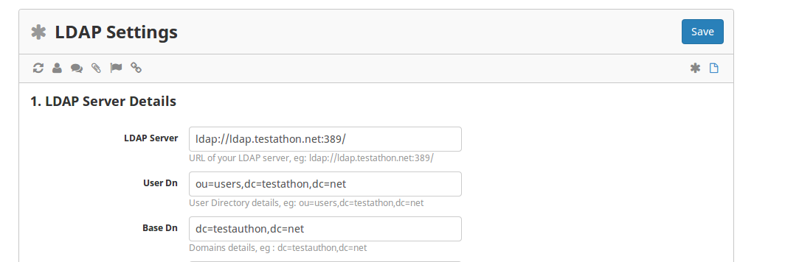
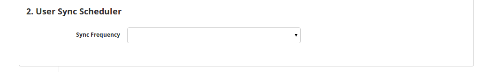
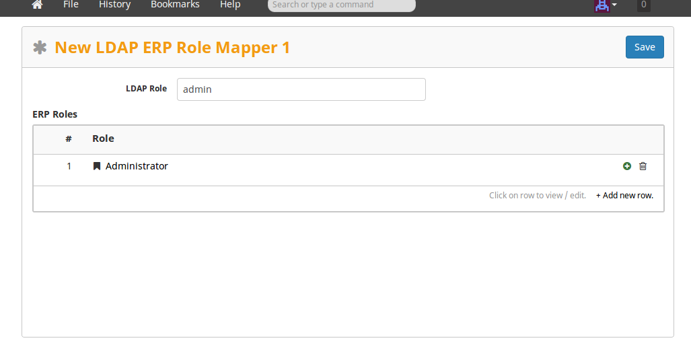
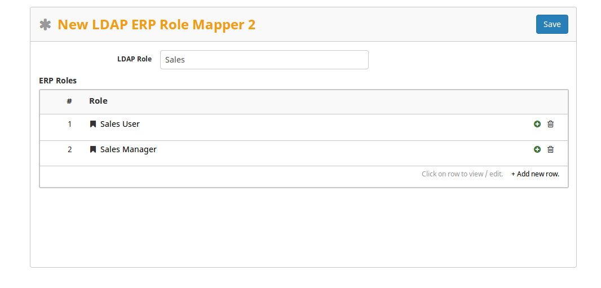
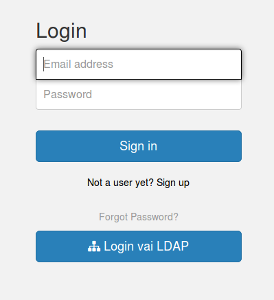
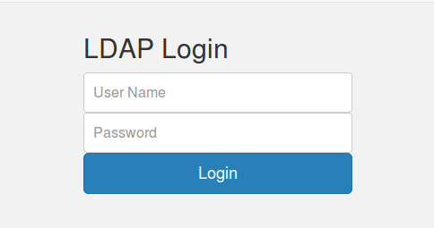

###Introduction:

Frappe LDAP app opens new wing of login. This app enables login with ldap credentials.  Few steps of configuration and you are ready to ldap login.

###Depends on
- frappe (To install: [bench page](https://github.com/frappe/bench) )
- python module, python-ldap
	To install python-ldap on ubuntu based system, use pip install python-ldap.  You may encounter dependency issue, to resolve these dependencies issue use   sudo apt-get install python-dev libldap2-dev libsasl2-dev libssl-dev  
 
###Installation

1. bench get-app frappe_ldap [https://github.com/saurabh6790/frappe_ldap.git ](https://github.com/saurabh6790/frappe_ldap.git)
2. bench frappe --install_app frappe_ldap your_site_name or install from frappe desk installer.

###Configuration Steps

####Setup Ldap Server Details
1. Logged in to frappe as Administrator and click on LDAP module.
2. To setup LDAP settings, goto Documents > LDAP Settings ( a single doctype) and fill up ldap server details. 

####Users and Role Management:

System checks ldap for select interval and sync user profiles and applies specified role under LDAP.
 To set sync interval, goto LDAP > Documents > LDAP Settings and select interval from option(Daily/Weekly/Monthly)

Added role mapper functionality, while creating a new profile it will check the mapped role and assigned it to respective(current) profile.  With this we can bypass manual role assignment process and automate the same.  To create mapper goto goto LDAP > Documents > LDAP ERP Role Mapper  
Eg 1:

Eg2:

###Login Via Ldap:

On login page, click on Login Via LDAP ldap button,

You will get redirected to ldap login page, enter ldap login id and password and click on login button.

